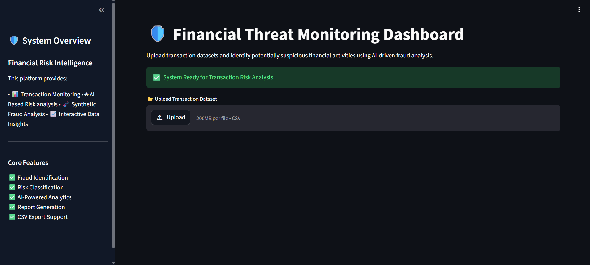
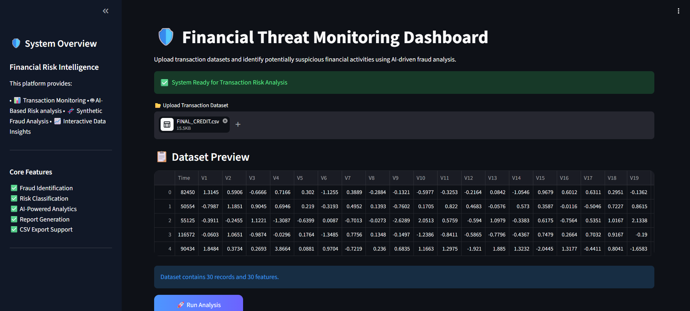
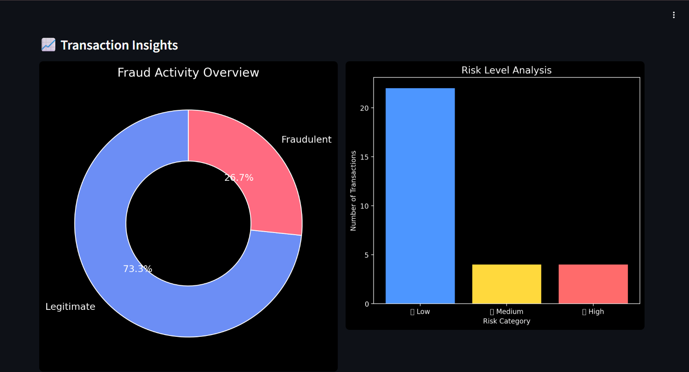
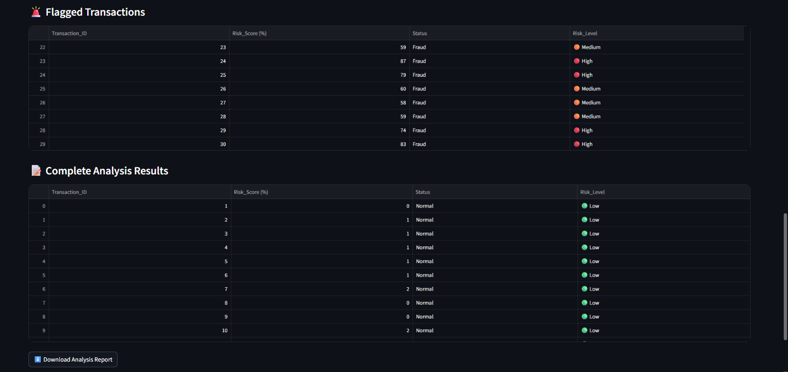

# 🛡️ Financial Threat Monitoring Dashboard

<p align="center">
  <b>Advanced Financial Fraud Monitoring using AI and CTGAN Synthetic Analysis</b>
</p>

---

# 🌐 Live Demo

🚀 Streamlit App:  
https://financial-threat-monitoring-dashboard-using-ctgan.streamlit.app/

[](https://financial-threat-monitoring-dashboard-using-ctgan.streamlit.app/)

---

# 📌 Project Overview

This project presents an AI-powered financial threat monitoring system designed to identify suspicious financial transactions using Machine Learning and CTGAN-generated synthetic fraud data.

Financial fraud datasets are highly imbalanced because fraudulent transactions represent only a very small portion of total transactions. This imbalance can negatively affect the performance of machine learning models.

To overcome this challenge, the project integrates:

- **CTGAN (Conditional Tabular GAN)** for synthetic fraud generation
- **Random Forest Classifier** for transaction risk prediction
- **Streamlit Dashboard** for interactive visualization and deployment

The system demonstrates how Generative AI techniques can improve fraud detection performance in real-world financial monitoring systems.

---

# 🚀 Key Features

✅ AI-Based Fraud Detection  
✅ Transaction Risk Classification  
✅ CTGAN Synthetic Fraud Generation  
✅ Interactive Risk Monitoring Dashboard  
✅ Downloadable Analysis Reports  
✅ Real-Time Dataset Analysis  
✅ Professional Visualization Interface  
✅ Fraud Activity Insights  

---

# 🛠️ Technology Stack

| Technology | Usage |
|---|---|
| Python | Core Development |
| Pandas | Data Processing |
| NumPy | Numerical Operations |
| Scikit-learn | Machine Learning |
| CTGAN / SDV | Synthetic Data Generation |
| Matplotlib | Visualization |
| Seaborn | Statistical Analysis |
| Streamlit | Dashboard Deployment |
| Joblib | Model Serialization |

---

# 📂 Dataset Information

The project uses the publicly available **Credit Card Fraud Detection Dataset** containing anonymized financial transaction features.

## Dataset Features

- `V1` to `V28` → PCA-transformed features
- `Time` → Transaction timestamp
- `Amount` → Transaction amount

## Target Variable

| Value | Meaning |
|---|---|
| 0 | Legitimate Transaction |
| 1 | Fraudulent Transaction |

---

# 📸 Dashboard Preview

## 🏠 Main Dashboard

<p align="center">
  
</p>

---

## 📂 Dataset Preview

<p align="center">
  
</p>

---

## 📊 Risk Analysis Summary

<p align="center">
  
</p>

---

## 📈 Transaction Insights

<p align="center">
  
</p>

---

## 🚨 Flagged Transactions

<p align="center">
  
</p>

---

# ▶️ Run Locally

## 1️⃣ Install Dependencies

```bash
pip install -r requirements.txt
```

## 2️⃣ Run Streamlit Application

```bash
streamlit run app.py
```

---

# 📂 Project Structure

```text
financial-threat-monitoring/
│
├── app.py
├── fraud_analysis_model.pkl
├── scaler.pkl
├── ctgan_model.pkl
├── synthetic_fraud.csv
├── combined_transactions.csv
├── transaction_risk_data.csv
├── requirements.txt
├── README.md
```

---

# 📌 Future Improvements

- Deep Learning-based fraud detection
- Real-time monitoring systems
- Cloud deployment integration
- Explainable AI implementation
- Advanced analytics dashboard

---

# 👨‍💻 Author

## D Md Khizer Farhaan

AI & Machine Learning Enthusiast  
Focused on AI Systems, Machine Learning, and Computer Vision.
